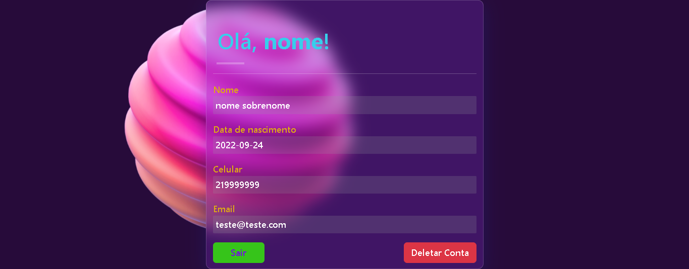
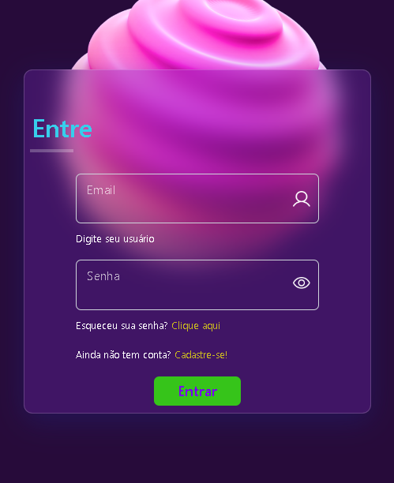
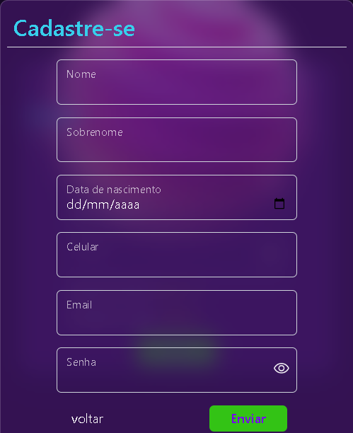
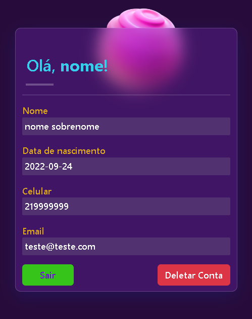

# Plataforma de Login e Cadastro
<p align="center">Plataforma de cadastro e login para estudo de uso de api e banco de dados.</p>
<h4 align="center"> Status do projeto: concluído.</h4>

### Tabela de conteudo

<p align="center">
<a href="#funcionalidades">funcionalidades</a> • 
<a href="#Demostração-da-Aplicação">Demostração</a> • 
<a href="#Como-executar-o-projeto">como Executar</a> • 
<a href="#Tecnologias-utilizadas">Tecnologias</a> •   
<a href="#autor">Autor</a> •
<a href="#licenc-a">Licença</a> 
</p>

### funcionalidades

- [x] Entrada de dados do usuário pelo modal de cadastro
- [x] Envio para o servidor com o uso da API
- [x] Resgatar os dados armazenados no sevidor e armazenar no localStorage
- [x] Comparar os dados informados no login com os armazenados no servidor
- [x] Redirecionamento para página contendo nome personalizado do usuário e seus dados informados
- [x] Botão de saída que redireciona para a página principal, exibindo uma mensagem de saída
- [x] Botão de Deletar que apaga a conta e redireciona para a página principal, exibindo uma mensagem de confirmação

### Demostração da Aplicação
* Criar um cadastro na plataforma;
* Efetuar o login;
* Visualizar a página com os dados inseridos no cadastro;
* Sair da página;
* Deletar conta;








### Como executar o projeto

Antes de começar, você vai precisar ter instalado em sua máquina as seguintes ferramentas:

Além disto é bom ter um editor para trabalhar com o código como [VSCode](https://code.visualstudio.com/)

```bash
# Clone este repositório
$ git clone <>

# Acesse a pasta do projeto no terminal/cmd
$ cd ...

# Execute a aplicação 
$ index.html ou server live(plugin do vscode)

```
            

### Tecnologias utilizadas

* HTML
* JavaScript
* CSS
* Bootstrap

### Autor
Feito com ❤️ por Laihanne Campelo 👋🏽 Entre em contato!

email: laihanne.campelo@gmail.com

### Licença
MIT License
